# Hastane Yönetim ve Randevu Sistemi

**Kapsam:** Web ve Masaüstü Uygulama  
**Teknolojiler:** HTML, CSS, JavaScript, PHP, MySQL, C#

---

## Proje Hakkında
Hastaların randevu almasını, doktorların hasta takibini ve tahlil yönetimini kolaylaştıran, ayrıca sağlık grubuna ait hastaneler, tıbbi birimler, doktorlar ve iletişim bilgilerinin yer aldığı dinamik tanıtım ögeleri içeren kapsamlı bir web ve masaüstü tabanlı hastane yönetim sistemi.

  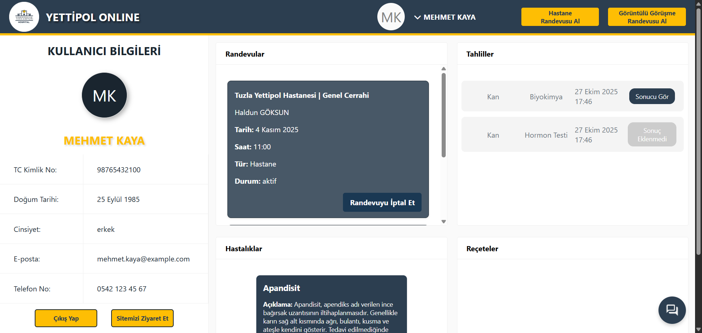

---

## Özellikler

### Hasta Deneyimi
- Hesap oluşturma veya misafir olarak devam etme  
- Hastane, bölüm ve doktor seçimi  
- Uygun tarih ve saat ile randevu alma (fiziksel ve görüntülü görüşme)  
- “Nereden randevu almalıyım?” ile belirtilere göre yönlendirme

  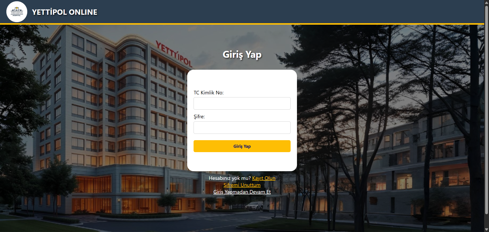
  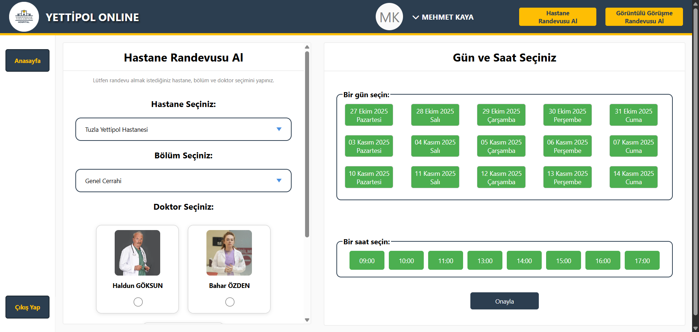

### Doktor Deneyimi
- Hastanın geçmiş, bugünkü ve gelecek randevularını görüntüleme  
- Kişisel ve tıbbi bilgileri takip etme  
- İlaç, hastalık ve tahlil girişi yapabilme

  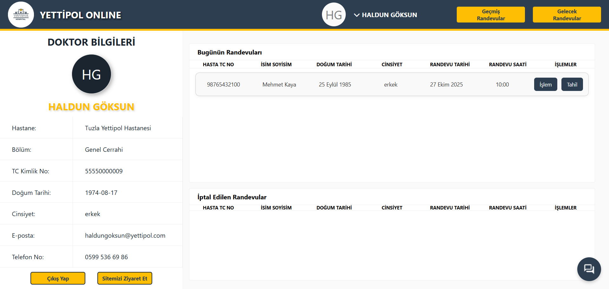
  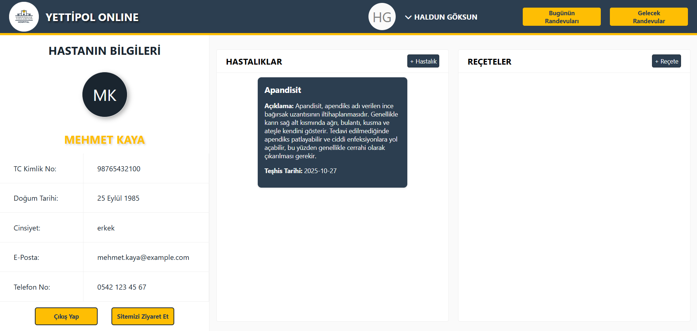
  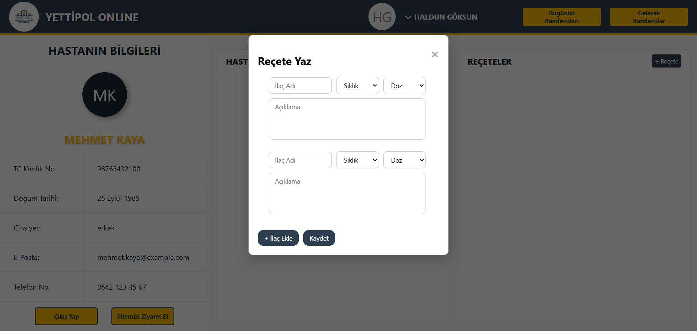
  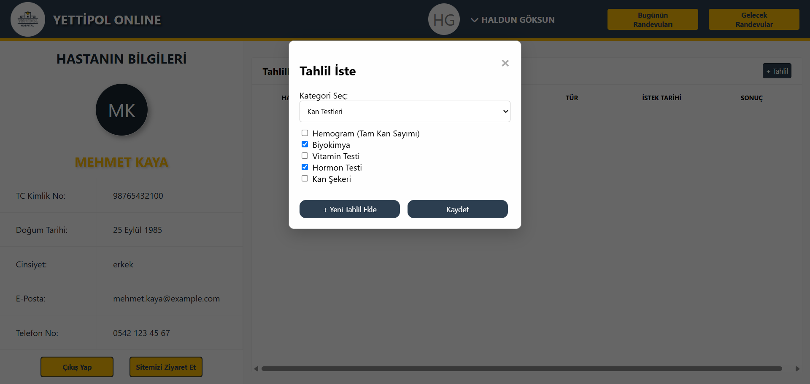

### Tahlil Yönetimi
- Teknisyenler tahlil sonuçlarını girer  
- PDF olarak doktor ve hastaya sunulur

  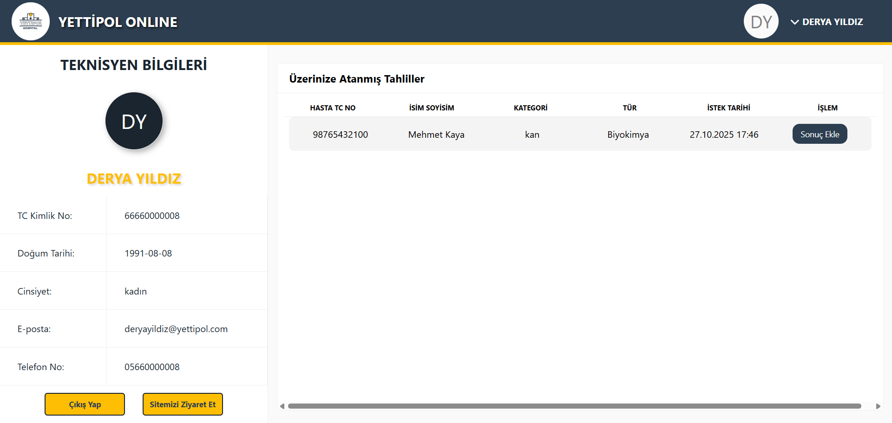
  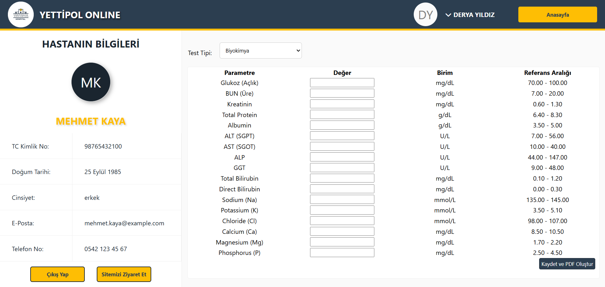
  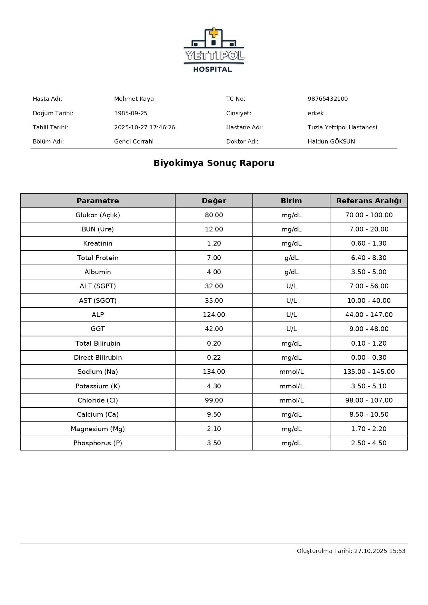

### Mesajlaşma & AI Bot
- Hasta-doktor iletişimi için mesajlaşma bölümü  
- Belirli sorulara yanıt veren bot desteği

  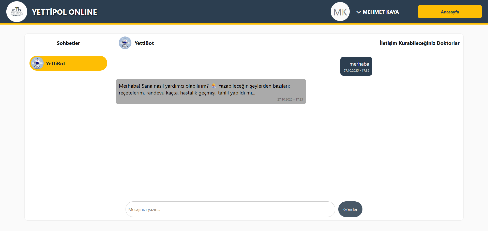

### Tanıtım & Bilgi
- Sağlık grubuna ait hastaneler, tıbbi birimler, doktorlar ve iletişim bilgilerinin yer aldığı dinamik tanıtım sitesi işlevi

  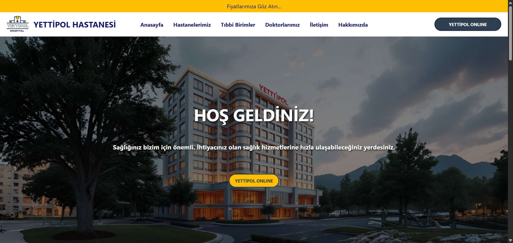
  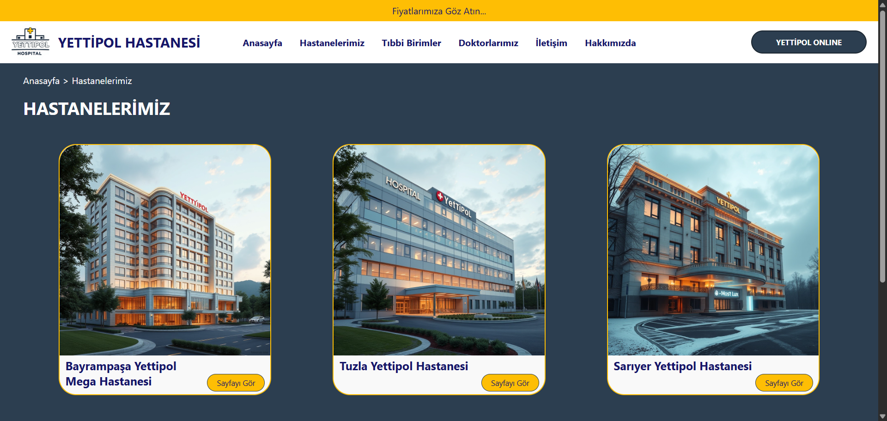
  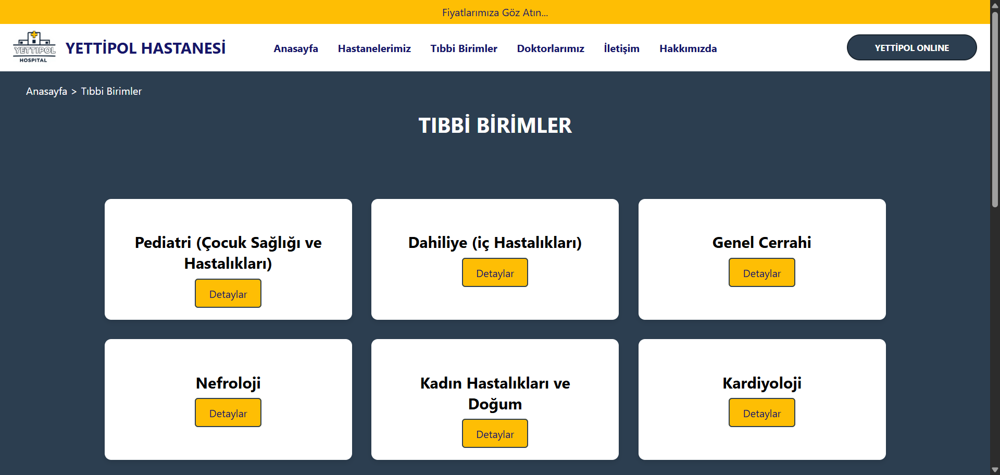
  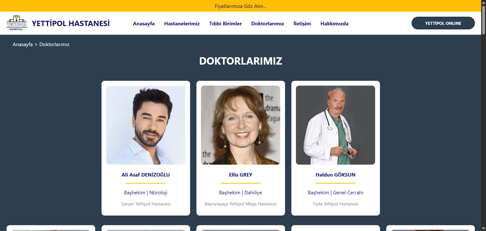

---

## Ekip ve Platform Çeşitliliği
- Proje 2 kişilik bir ekip ile yürütüldü; görev dağılımları yapıldı.  
- Web uygulamasındaki tüm özellikler web platformunda geliştirilirken, ekip arkadaşımın liderliğinde bu özellikleri kapsayan C# Windows Forms masaüstü uygulaması da paralel olarak geliştirildi.

  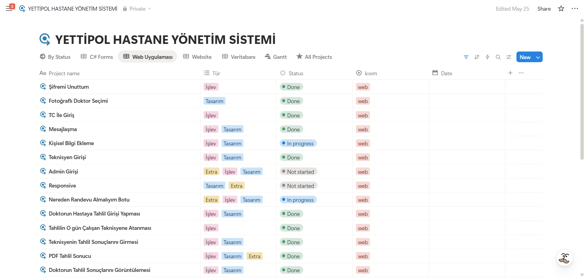

---

## Teknolojiler
- **Web:** HTML, CSS, JavaScript, PHP, MySQL  
- **Masaüstü:** C# Windows Forms

---

## Sonuç
Bu proje sayesinde hastane randevu, tahlil ve tanıtım süreçleri daha hızlı, düzenli ve kullanıcı dostu hâle getirildi.

  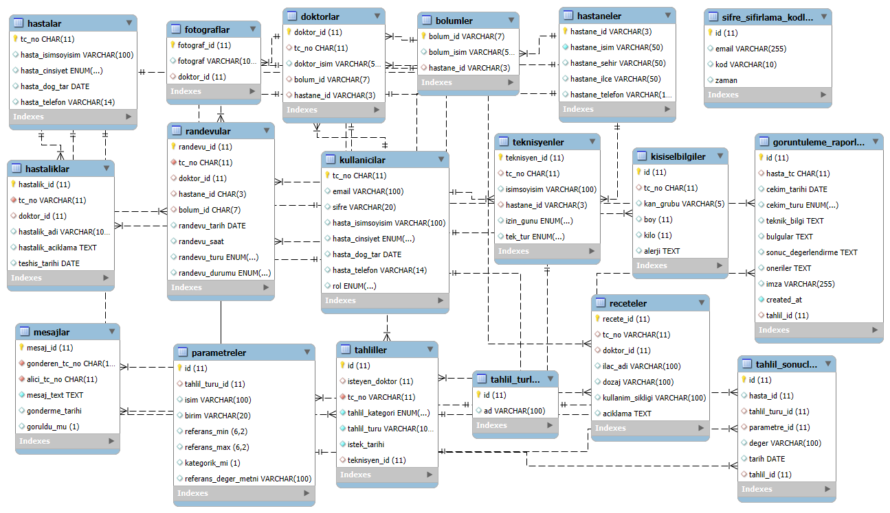

